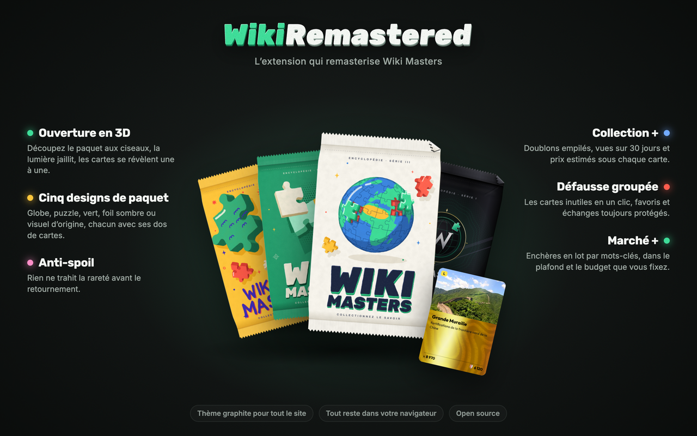

# WikiRemastered



Une extension de navigateur non officielle pour [Wiki Masters](https://www.wiki-masters.com), le jeu de cartes Wikipédia : un thème graphite pour tout le site, des ouvertures de paquets en 3D et des outils pour la collection et le marché. Réalisée par un joueur, elle n’est ni éditée ni approuvée par Wiki Masters.

## Ce qu’elle fait

- **Ouverture en 3D** : le paquet arrive en volume, se découpe aux ciseaux, la lumière et des pièces de puzzle en jaillissent, puis les cartes se révèlent une à une, la meilleure en dernier.
- **Cinq designs de paquet** : globe (par défaut), puzzle, vert, foil sombre ou visuel d’origine, chacun avec ses dos de cartes.
- **Anti-spoil** : rien ne trahit la rareté avant le retournement.
- **Collection +** : doublons empilés, vues sur 30 jours et prix estimés sous chaque carte.
- **Défausse groupée** : les cartes que personne ne regarde, en un clic ; favoris, échanges et mots protégés sont toujours conservés.
- **Marché +** : vues et prix sous les enchères, filtres, enchères en lot par mots-clés dans un plafond et un budget que vous fixez.
- **Thème graphite** pour tout le site, et réclamation automatique des succès débloqués.

Chaque ouverture de paquet se fait d’un clic de votre part. Tout reste dans votre navigateur, sur wiki-masters.com uniquement : [règles de confidentialité](store/privacy.md).

## Installer

**Chrome Web Store** : en cours d’examen.

**À la main** (Chrome, Edge, Arc, Brave) :

1. Télécharger `WikiRemastered-<version>.zip` dans la [dernière release](https://github.com/Lypningeuh/WikiRemastered/releases/latest) et le décompresser.
2. Ouvrir `chrome://extensions` et activer le **mode développeur**.
3. **Charger l’extension non empaquetée** et choisir le dossier décompressé.
4. Recharger les onglets Wiki Masters.

## Développer

L’extension est en JavaScript et CSS, sans compilation : le dossier `extension/` se charge tel quel.

| Dossier | Contenu |
|---|---|
| `extension/` | L’extension (Manifest V3). |
| `lab/` | Pages de test locales, dont l’ouverture avec des paquets simulés (`lab/pack-opening.html`) : aucun paquet réel n’est consommé. |
| `scripts/` | Génération de la marque et des visuels de paquets, captures de la fiche, empaquetage. |
| `store/` | Fiche Chrome Web Store, règles de confidentialité, images. |
| `film/` | Le film de lancement, fait avec Remotion ([README](film/README.md)). |
| `docs/` | [Référence technique](docs/TECHNIQUE.md) et [choix visuels](docs/DESIGN.md). |

Pour les pages du labo, servir le dépôt puis ouvrir `http://localhost:8000/lab/pack-opening.html` :

```bash
python3 -m http.server 8000
```

Pour produire dans `dist/` le dossier installable, son ZIP et le ZIP du Chrome Web Store :

```bash
python3 scripts/package.py
```

Les visuels se régénèrent avec `node scripts/pack-art-globe.mjs` (de même `pack-art-puzzle.mjs` et `pack-art-green.mjs`), et le logo, l’icône et les vignettes avec `node scripts/brand.mjs` puis `sh scripts/brand-png.sh`.

## Licence

[MIT](LICENSE).
